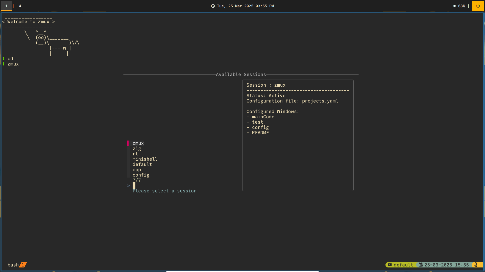

# Zmux-Sessionizer
Zmux is a shell script written in bash to create, manage and open session in `Tmux`.
You can check [here](https://github.com/MrSloth-dev/.dotfiles/blob/main/scripts/zmux.sh) the shell script that was the origin of the idea for this plugin.



# Instalation

``` bash
mkdir -p ~/.local/bin/
wget https://raw.githubusercontent.com/MrSloth-dev/eZmux/refs/heads/main/zmux -O ~/.local/bin/zmux
chmod u+x ~/.local/bin/zmux
# Add to .bashrc or .zshrc or add /.local/bin to $PATH
# echo 'alias zmux="~/.local/bin/zmux"' >> ~/.zshrc
export PATH=$PATH:~/.local/bin/
source ~/.zshrc
```

## Dependencies

- `tmux` version greater or equal to `v3.3`.
- `yq` version greater or equal to `v4.44.6`. This tool allows the configuration parsing.
- `fzf` This tool allows quick and interactive listing of all pre-configured and opened sessions.

# Usage

The main goal of this script is to be simple, there are two ways of invoking the script:
 - `zmux` will spawn a `fzf` window that list all active and pre-configured sessions.


 **Note**: Press Ctrl-t to toggle the `fzf` preview-window.

 - `zmux <sesison-name>` will search if session is active or exist in configuration files. If not, it prompts the user to create a new session.

 - `zmux -k` or `--kill` to kill the `tmux` server

 - `zmux -e` or `--export` to export the current session into a `YAML` file

 - `zmux -h` or `--help` to print the help message

# Configuration

All configurations will be sourced in `YAML` format under `~/.config/zmux/` directory.

You can have multiple sessions pre-configured in each file:
```
~/.config/zmux/
  ├── work.yaml      # Work-related sessions
  ├── personal.yaml  # Personal project sessions
  ├── dev.yaml       # Development environment sessions
  └── server.yaml    # Server management sessions
```

For a basic session:

``` yaml
sessions:
  project_a:
    root: ~/Projects/ProjectA/
    windows:
      - name: Editor
        command: nvim .
      - name: Terminal
        command: ls
  project_b:
    root: ~/Projects/ProjectB/
    windows:
      - name: Code
        command: nvim main.cpp
      - name: compiling
        command: echo hello
      - name: README.md
        command: nvim README.md
```

Note: For now, there isn't layout and split panes but will be implemented.

# Roadmap | TODO
- [x] Create Session with `zmux <session_name>`
  - [x] Assign root directory
  - [x] Create Normal Windows and rename them
  - [x] Create Windows with different Panes
  - [x] Send Commands to each pane
- [x] `zmux` without args list all available sessions opened and in the configuration file
  - [x] fzf
- [x] Export the current session into a YAML file for future usage.
- [x] Use multiple files instead of only `config.yaml`
- [x] Preview windows in fzf list
- [ ] Different layouts for splits
- [ ] Sugestions are welcome!

# Changelog

### [0.3] - 2025-1-3

### Added

- Added support for multiple configuration files, now you can do it like this:

- Added window Preview when seeing in `fzf list` , can press `ctrl-t` to toggle preview-window.

### [0.2] - 2024-12-29
 
### Added
   
- Now you can see help with `-h` or `--help`
- Easier kill server with `-k` or `--kill` flag.
- Now you can export configuration of current session using `-e` or `--export` flag.
 - Note: The command will be always empty. It still exist to easen the completion of the configuration. Still finding a way to implement this. 
- Added creating new sessions if the user inputs a non-existant name (still need to export if want to save)
- If Config file isn't found, create an empty one.

### Bugfix
- When there wasn't a tmux server, `zmux` didn't work.
- Now `session_name` can only have alphanumeric, underscore and hyphen.
- If there wasn't any sessions in config file `zmuz` didn't work.

### [0.1.1] - 2024-12-22

### Bugfix

- Fixed yq parse because I was using an older version. Now it requires v4.44.6.
- Fixed error when user inserted an non existent and not configured session name.
- Root folder wasn't being set correctly.

### [0.1] - 2024-12-14
 
### Added
   
- This is the first Version.
- List all avaiable sessions trough `fzf`
- It fetch the preconfigured sessions in '~/.config/zmux/config.yaml'
- When Selected, it create/opens the session.

## License
MIT
